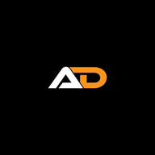

<div align="center">



# 🌌 Arup Das — Portfolio v2.0

### AI/ML Developer · React Developer · Photographer

[](https://arup-portfolio08.netlify.app)


**[🚀 Live Demo](https://arup-portfolio08.netlify.app)** · **[📂 GitHub](https://github.com/arupdas0825/portfolio-website)** · **[💼 LinkedIn](https://linkedin.com/in/arupdas0825)**

</div>

---

## 📸 Preview

| Home | Work | Photography |
|------|------|-------------|
| Orbital 3D Widget + Typewriter | GitHub Auto-Fetch Repos | Cinematic Lightbox |

---

## ✨ Features

### 🎨 Design & Theme
- **Dark Purple Theme** — deep `#0a0812` background with `#8a5cf6` purple accents
- **Ambient Blob Background** — animated radial glow blobs with noise texture overlay
- **Syne + DM Sans** typography for a premium, modern feel
- **Smooth scroll animations** — IntersectionObserver-based fade-in on all sections
- **Custom AD Logo** — favicon, logo192, logo512 all updated
- **Purple scrollbar** styling

### 🏠 Home Section
- **Orbital 3D Widget** — spinning rings with emoji orbit dots and pulsing core
- **Typewriter Effect** — 8 rotating roles with blinking cursor:
  - AI/ML Developer, React Developer, Android App Developer, Full Stack Developer, Open Source Contributor, Photographer & Videographer, Problem Solver, B.Tech CSE (AIML) Student
- `< HELLO WORLD />` code-style tag
- "Available for opportunities" live badge with green pulse dot
- Social links — GitHub, LinkedIn, Instagram

### 🧭 Navbar
- **Single-page smooth scroll** — no separate page routing
- **Pill-style floating navbar** with icons — Home, About, Work, Photography, Services, CV, Contact
- **Auto-highlights active section** on scroll using `IntersectionObserver`
- Glass morphism blur background
- Sections: Home · About · Work · Photography · Services · CV · Contact

### 👤 About Section
- Profile photo with layered border rings
- Detailed bio with highlighted keywords
- **3 Skill Group cards** — Languages, Specializations, Creative Tools
- Hover glow effects on skill cards

### 💼 Work Section — Dynamic GitHub Integration
- **Fetches ALL repos automatically** from GitHub API (paginated, no hardcoding)
- New repos appear instantly — **no manual updates needed**
- **Language filter pills** — filter by JavaScript, Python, Java, Kotlin etc.
- Each card shows: language color dot, star count ⭐, fork count 🍴
- Live Demo button appears **only when** GitHub homepage URL is set
- Language → emoji mapping (Python=🐍, Java=☕, Kotlin=📱 etc.)
- Loading spinner while fetching
- "View All on GitHub" CTA button

### 📊 GitHub Stats Section
- **Orbitron font** title with purple gradient glow
- Live stats: Stars, Forks, Repositories, Followers, Following (CountUp animation)
- Large info panel: Total Stars, Commits, PRs, Issues
- **Circular progress ring** for top language (75% JS)
- Language breakdown with animated progress bars
- Streak stats: Total Contributions, Current Streak, Longest Streak
- All data from GitHub REST API

### 📷 Photography Section
- **10 cinematic photos** with custom titles and descriptions
- **Masonry-style 4-column grid**
- Hover overlay with photo title
- **Lightbox** — side-by-side layout:
  - Left: full photo
  - Right: title + purple accent line + detailed description
- Keyboard navigation: `←` `→` to cycle, `Esc` to close
- Arrow navigation buttons

### ⚙️ Services Section
- 6 service cards: Web Development, AI/ML Solutions, Mobile App Dev, Creative Direction, Data Analysis, Backend Systems
- Icon + title + description + skill tags
- Top gradient line animation on hover

### 📄 CV Section
- Side-by-side layout: CTA left, preview card right
- CV preview card with blurred content rows
- View CV + Download CV buttons

### 📬 Contact Section
- Two-column layout: info left, form right
- Contact info: Email, Location, University
- Social icons: GitHub, LinkedIn, WhatsApp
- Form fields: Name, Email, Subject, Message
- Glowing Send button

---

## 🗂️ Project Structure

```
arup-portfolio/
├── public/
│   ├── favicon.ico          # Custom AD logo
│   ├── logo192.png          # PWA icon
│   ├── logo512.png          # PWA icon large
│   ├── arup.jpg             # Profile photo
│   ├── CV.pdf               # Downloadable CV
│   ├── photos/              # Photography gallery
│   │   ├── 1.jpg  → 10.jpg
│   └── index.html
│
├── src/
│   ├── App.js               # Root — single page, all sections
│   ├── App.css              # All styles — dark purple theme
│   ├── Navbar.js            # Floating pill navbar, smooth scroll
│   ├── Home.js              # Hero + orbital widget + typewriter
│   ├── About.js             # Bio + skill groups
│   ├── Work.js              # GitHub API auto-fetch repos
│   ├── GithubStats.js       # Live GitHub stats + charts
│   ├── Gallery.js           # Photography + lightbox
│   ├── Services.js          # Services cards
│   ├── CV.js                # CV preview + download
│   ├── Contact.js           # Contact form + socials
│   └── index.js
│
├── .env                     # DISABLE_ESLINT_PLUGIN=true
├── package.json
├── tailwind.config.js
└── README.md
```

---

## 🛠️ Tech Stack

| Category | Technology |
|---|---|
| **Framework** | React 18 (Create React App) |
| **Styling** | Tailwind CSS + Custom CSS Variables |
| **Animations** | Framer Motion, CSS Keyframes |
| **Icons** | Lucide React |
| **Fonts** | Syne, DM Sans, Orbitron (Google Fonts) |
| **API** | GitHub REST API v3 |
| **Deployment** | Netlify (auto-deploy from GitHub) |

---

## 🚀 Getting Started

### Prerequisites
- Node.js v18+
- npm or yarn

### Installation

```bash
# Clone the repository
git clone https://github.com/arupdas0825/portfolio-website.git

# Navigate to project
cd portfolio-website

# Install dependencies
npm install

# Start development server
npm start
```

Open [http://localhost:3000](http://localhost:3000) in your browser.

### Build for Production

```bash
npm run build
```

### Environment Variables

Create a `.env` file in the root:

```env
DISABLE_ESLINT_PLUGIN=true
```

---

## 📦 Dependencies

```json
{
  "react": "^18.x",
  "framer-motion": "^10.x",
  "lucide-react": "^0.x",
  "tailwindcss": "^3.x"
}
```

---

## 🌐 Deployment

This portfolio is deployed on **Netlify** with auto-deploy on every `git push` to `main`.

**Deploy your own:**

1. Fork this repository
2. Connect to [Netlify](https://netlify.com)
3. Set build command: `npm run build`
4. Set publish directory: `build`
5. Add environment variable: `DISABLE_ESLINT_PLUGIN=true`
6. Deploy! 🚀

---

## 🎨 Color Palette

```css
--bg:            #0a0812   /* Deep dark background */
--purple:        #8a5cf6   /* Primary accent */
--purple-light:  #a78bfa   /* Light purple */
--accent:        #c084fc   /* Hover accent */
--card:          rgba(30,22,55,0.85)  /* Card background */
--text:          #e2d9f3   /* Body text */
--text-muted:    #9d8ec4   /* Muted text */
```

---

## 📝 Customization

### Add/Edit Typewriter Roles
In `src/Home.js`, edit the `ROLES` array:
```js
const ROLES = [
  'AI / ML Developer',
  'Your Custom Role Here',  // ← add here
  ...
];
```

### Add Photography
Place images in `public/photos/` and add entries in `src/Gallery.js`:
```js
{ id: 11, src: "/photos/11.jpg", title: "Your Title", desc: "Your description..." }
```

### Update GitHub Username
Change `GITHUB_USERNAME` in `src/Work.js` and `src/GithubStats.js`:
```js
const GITHUB_USERNAME = 'your-github-username';
```

---

## 📜 License

This project is licensed under the **MIT License** — feel free to use it as inspiration for your own portfolio.

---

<div align="center">

**Designed & Built by [Arup Das](https://arup-portfolio08.netlify.app)**

*B.Tech CSE (AIML) · Brainware University · Kolkata*

⭐ **Star this repo if you found it helpful!**

</div>
